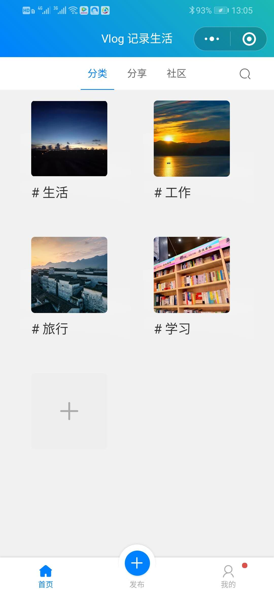
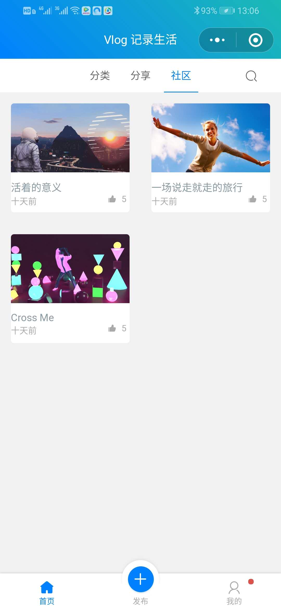
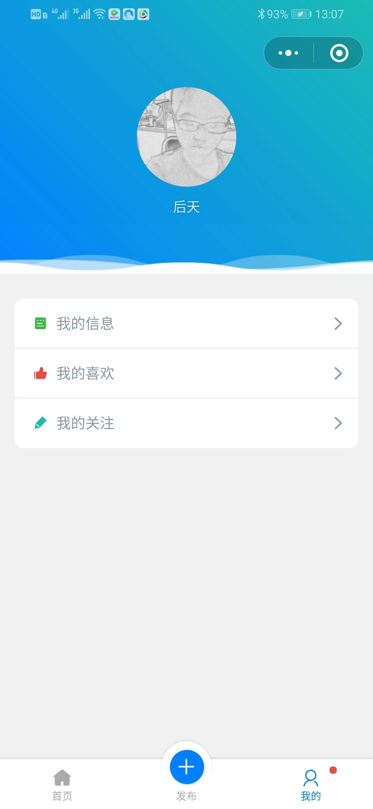
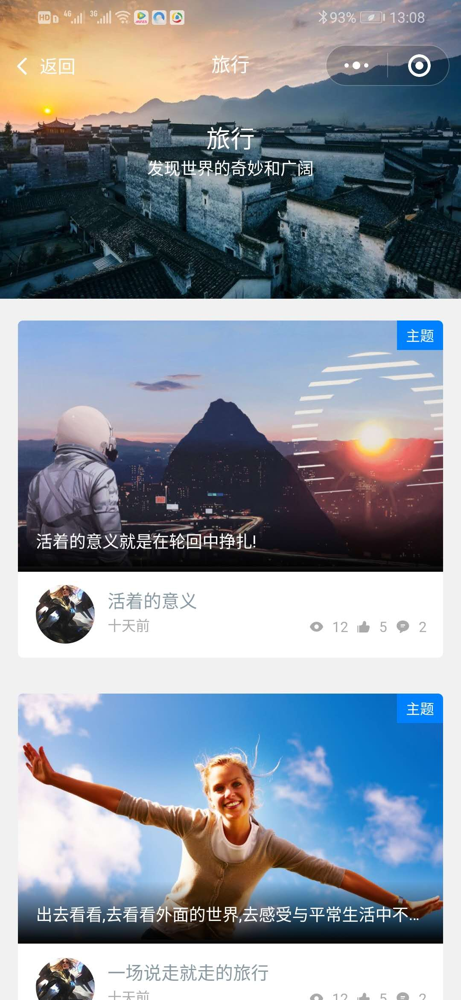

# 微信小程序 VlogLife
微信小程序VlogLife，欢迎扫描以下小程序码体验。

> 提示：请使用微信开发者工具或微信客户端 6.7.2 及以上版本运行。

## 服务端

关联API服务(`node.js`)： [vlog-node](https://github.com/jigang-duan/vlog-node)

- web框架： midway.js
- 语言： typescript
- 数据库： mysql

## 使用

使用[微信开发者工具](https://developers.weixin.qq.com/miniprogram/dev/devtools/download.html)打开该项目

## 贡献

如果你有 bug 反馈或其他任何建议，欢迎提 issue 给我们。

如果你愿意一起来完善小程序示例，欢迎通过 PR 的方式贡献代码。为了保证代码风格的统一，在编写代码之前，请在项目根目录运行以下命令安装依赖：

```bash
npm install
```

同时，确保你的代码可以通过 Lint 检查：

```bash
npm run lint
```

## 截图








